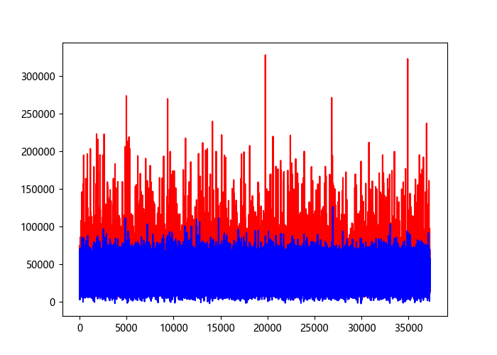
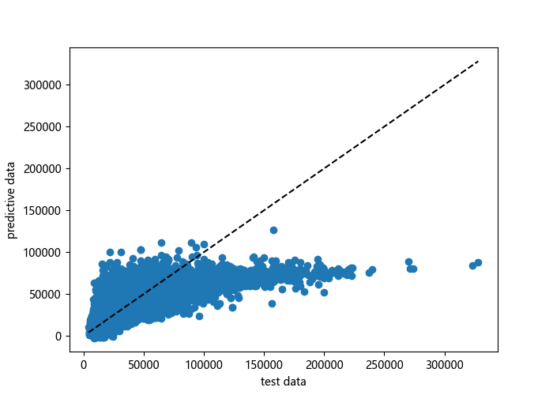
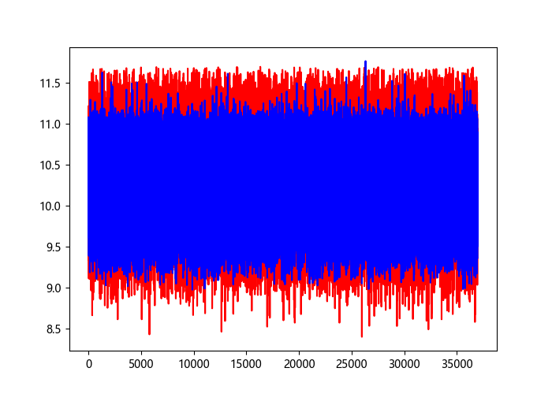
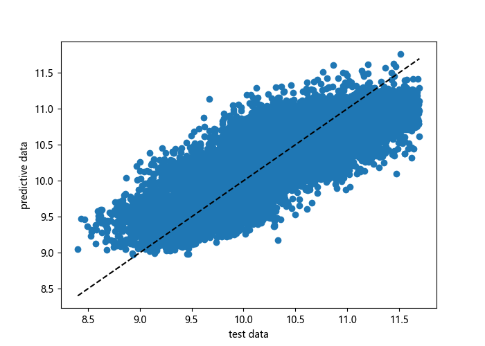

## 项目简介

本项目于2023年5月至7月每月初爬取链家网广州（https://gz.lianjia.com/ershoufang） 二手房数据作为本项目数据集，尝试对广州市二手房价格进行建模，并通过建立的模型预测广州市二手房价格。

## 数据爬取

### 爬虫编写

通过在网页源码中搜索关键字的方式，首先确定链家网广州二手房网站为静态网站，再浏览不同页面进行观察，总结出链家网上海二手房网站的URL具有如下规律。依照以上规律，我们可以通过爬虫实现对链家网广州二手房网站每一页数据的爬取。

```
第一页：https://gz.lianjia.com/ershoufang/pg1/
第二页：https://gz.lianjia.com/ershoufang/pg2/
第三页：https://gz.lianjia.com/ershoufang/pg3/
第n页：https://gz.lianjia.com/ershoufang/pgn/
越秀区第n页：https://gz.lianjia.com/ershoufang/yuexiu/pgn/
荔湾区第n页：https://gz.lianjia.com/ershoufang/liwan/pgn/
```

### 爬取方式

由于链家网广州二手房网站每一页数据有限，每一页只能呈现30条数据，最多可访问100页。那么，如果仅对首页 （https://gz.lianjia.com/ershoufang/pgn/） 进行爬取，得到的数据量只有3000条，远远比不上真实的放盘数据的。但是经过分析可以发现如果按照广州市的行政区进行筛选，每个行政区子页面会呈现出不同的房源。再进一步，可以对不同行政区的房源再按楼层，装修等特点进行分类，同时将各类的总页面控制在100页以内，这样就可以获得广州市的全部放盘数据量。

这种方式虽然耗时稍长，但是获取的数据量最为真实和全面。我最终便采取这种方式对数据进行爬取，每月可成功获得了约120,000+条数据，匹配链家网主页上的全市放盘总量。

### 数据集

我将最终爬取的原始数据储存于项目的数据库（data.sqlite）中，到示例如下：

```
keywords	district	region	position	rooms	living_rooms	area	direction	decoration	floor	total_floor	built_year	building	subway	taxfree	total_price	reference	unit_price	date
房改房,满五年,精致实用小户型	天河	员村四横路5号大院 	员村	1	1	54.44	南,北	简装	低	3			0	0	170.0	0	31228	2023-05-08
税点低,户口不占用,产权清晰,楼层适中	天河	保利世纪绿洲一期 	龙洞	1	1	39.12	东南	简装	低	6	2003		0	0	188.0	0	48058	2023-05-08
南北对流，带大平台，诚心卖,可谈	天河	羊城花园 	东圃	1	1	41.9	北	简装	6		1999		1	0	155.0	0	36993	2023-05-08
天河北,德荣小区,户型方正实用,电梯房,封闭小区管理好	天河	德荣小区 	龙口西	1	0	38.59	东,北	精装	低	8	1995		0	0	275.0	0	71262	2023-05-08
龙口东路翠竹苑,1室1厅,南	天河	龙口东路翠竹苑 	龙口东	1	1	89.62	南	简装	低	7	1995		0	0	430.0	0	47981	2023-05-08
```

可以看到数据集中包含如下属性：
1. keywords: 房源关键词
2. district：所在行政区
3. region: 所在小区
4. position: 所在板块
5. rooms：房间数目
6. living_rooms：客厅数目
7. area：面积
8. direction：朝向
9. decoration：装修情况
10. floor：所在楼层
11. total_floor：所在楼栋的总层数
12. built_year：建成年份
13. building: 塔楼or板楼
14. subway: 是否近地铁
15. taxfree: 是否免税费
16. total_price: 总价（万元）
17. reference：是否有政府指导价
18. unit_price：每平米单价

## 数据预处理

### 数据总览

调用 overview 函数对读取存于数据库的原始数据集进行观察，得到数据集的总览信息如下：

```
Data columns (total 19 columns):
 #   Column        Non-Null Count   Dtype
---  ------        --------------   -----
 0   keywords      362698 non-null  object
 1   district      362698 non-null  object
 2   region        362698 non-null  object
 3   position      362698 non-null  object
 4   rooms         362698 non-null  int64
 5   living_rooms  362698 non-null  object
 6   area          362698 non-null  float64
 7   direction     362698 non-null  object
 8   decoration    362698 non-null  object
 9   floor         362698 non-null  object
 10  total_floor   337487 non-null  float64
 11  built_year    286962 non-null  float64
 12  building      68565 non-null   object
 13  subway        362698 non-null  int64
 14  taxfree       362698 non-null  int64
 15  total_price   362698 non-null  float64
 16  reference     362698 non-null  int64
 17  unit_price    362698 non-null  int64
 18  date          362698 non-null  object
dtypes: float64(4), int64(5), object(10)
```

从上结果可以看出，total_floor, built_year 和 building 是包含一定空数据的，所以我们需要对数据进行清洗和修饰。

### building

对 building 属性进行可视化观察，通过调用 visualize_building 函数，得到了如下图像：


通过图像发现，NaN的比例很高，因为决定删除 building 这个特征。

至于 built_year，我们采用全数据集 built_year 的中位数替代 NaN
值。

```python
year_median = df['built_year'].median()
df['built_year'] = df['built_year'].fillna(year_median)
```

### direction

direction 属性在数据集中出现了以东南西北组合各种形式，较为复杂，因为需要对其进行筛选。考虑到购房者对阳光的实际需求，决定对 direction 属性做如下划分：

* direction 属性中包含“南”：置为1
* direction 属性中未包含“南”：置为0

```python
data = df.loc[:, 'direction']
res_data = []

for i in data:
   cnt = 0
   for tmp in i:
      # '南' =（\u5357）
      if tmp == '\u5357':
            cnt = cnt + 1
   if cnt >= 1:
      res_data.append(1)
   else:
      res_data.append(0)

df_res = pd.DataFrame(res_data)
df['direction'] = df_res
```

### floor

floor 属性在数据值中集中在“低”，“中”，“高” 三个值中，还有其他数值型的值。


通过统计我们可知总高32层的高层楼房数量最多：
```
9.0     53398
18.0    25699
8.0     20264
7.0     19030
32.0    18313
6.0     17860
11.0    16115
33.0    12544
17.0    10102
28.0     9690
...     ...
```

所以我将以总高32层作为基准对未知总楼层为 floor 属性进行分类，所在楼层低于总层数三分之一或者低于10楼（未知总层高）的归为低楼层，所在楼层低于总层数三分之二或者低于20楼（未知总层高）的归为中楼层，所在楼层高于总层数三分之二或者高于20楼（未知总层高）的归为高楼层。

```python
floor = df['floor'].tolist()
total_floor = df['total_floor'].tolist()
res_data = []

for index, i in enumerate(floor):
   if i in ['低', '中', '高']:
      res_data.append(i)
   else:
      i = word_to_num(i)
      if math.isnan(total_floor[index]):     
            if i <= 10:
               res_data.append('低')
            elif i <= 20:
               res_data.append('中')
            else:
               res_data.append('高')
      else:
            if i <= total_floor[index] / 3:
               res_data.append('低')
            elif i <= 2 * (total_floor[index] / 3):
               res_data.append('中')
            else:
               res_data.append('高')

df_res = pd.DataFrame(res_data)
df['floor'] = df_res
```

### model

二手房的户型属性（rooms and living_rooms）在获取数据的时候已经做了拆分和预处理，这里我们只需要剔除非数值的数据。

```
3     156437
2     120363
1      39240
4      36447
5       7501
6       1851
7        498
8        226
9        116
10        16
12         2
20         1
Name: rooms, dtype: int64
2    121094
1    103976
2     65632
1     61147
0      4958
0      3538
3      1384
3       680
4       139
4        59
室        40
5        20
6        12
5         9
6         5
7         2
7         1
8         1
8         1
Name: living_rooms, dtype: int64
```

### 数据编码

对于 district, floor, decoration 三个属性，我们选择采用独热码对其进行那个编码。函数例子如下：

```python
def encode_decoration(df):
    dummies = pd.get_dummies(df['decoration'])
    tmp = pd.concat([df, dummies], axis=1)
    del tmp['decoration']
    tmp.rename(columns={'精装': 'hardcover', '简装': 'simplicity', '毛坯':'rough', '其他': 'other'}, inplace=True)
    df = tmp
    return df
```

## 数据建模与调优 

#### 数据建模

在数据建模上，我们选择 sklearn 库中的 LinearRegression 线性回归模型进行建模。我们将选择 2023 年 9 月的二手房数据作为一个数据集进行分析。

```python
def train_LR(df):
    x_train, x_test, y_train, y_test = train_data(df)
    # perform regression
    lr = LinearRegression()
    lr.fit(x_train, y_train)  
        # print(lr.coef_)  
        # print(lr.intercept_) 
    y_pred = lr.predict(x_test)
    # output result
    train_result(y_test, y_pred)
    # output plot
    train_plot(y_test, y_pred)
```

#### 模型调优

初次对模型进行训练，得到结果如下：






```
MSE: 225870504.76260704
RMSE: 15028.988813709559
Rsquare: 0.5727435699161345
Adj_Rsquare: 15923.9926363655
```

通过图像可以看出，在尾部有很多偏离回归的噪点，主要集中在均价大于 150000 的范围内。这些噪点影响了模型的准确性。为了提高模型的准确性，我们可以剔除噪点, 筛去总价过高的二手房。最后经过统计分析，我们选择筛去均价均价大于 150000 的二手房，而这部分数据占总体数据量约为 0.8%。

```python
print(len(df[df['unit_price'] > 150000])/len(df['unit_price']))
df = df[df['unit_price'] <= 150000]
```

删去数据后再次对模型进行训练，得到结果如下：


```
MSE: 151610794.49443346
RMSE: 12313.033521209689
Rsquare: 0.6140889886464301
Adj_Rsquare: 14261.95551355982
```

此时，得出的结果相较于初始拟合已经有了很明显的优化，但是拟合程度仍然不够好。于是对数据列 unit_price 进行平滑处理，减少噪声对模型的影响。平滑处理后，得到的结果如下：






此时，模型的拟合程度较调优指出得到了很大的提升：

```
MSE: 0.09430100166553648
RMSE: 0.30708468158723984
Rsquare: 0.7044386643501697
Adj_Rsquare: 10923.17359760383
```

## 备注

##### 生成 requirement.txt

```python
pip3 install pipreqs
pipreqs --encoding=utf8
```
